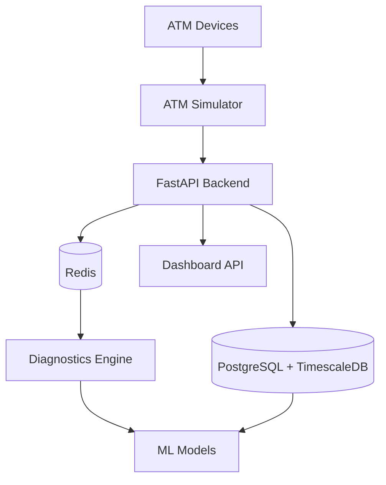
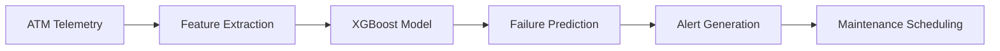

# 🏪 ATM Monitoring System

[](https://www.python.org/downloads/)
[](https://fastapi.tiangolo.com/)
[](https://www.postgresql.org/)
[](https://www.timescale.com/)
[](https://redis.io/)
[](https://www.docker.com/)

**Complete ATM Monitoring, Real-time Analytics & Predictive Maintenance System**

A comprehensive solution for real-time telemetry collection from 500+ ATMs, dashboard monitoring, anomaly detection, and failure prediction.

## 🎯 Key Features

- 🔄 **Real-time Telemetry Collection**: Data collection from 500+ ATMs per second
- 📊 **Live Dashboard**: REST API-based monitoring interface
- 🤖 **AI-powered Diagnostics**: Machine learning for anomaly detection and failure prediction
- ⚡ **High-performance Time-series DB**: Efficient data storage with TimescaleDB
- 🚨 **Real-time Alerts**: Redis Pub/Sub based event processing
- 🐳 **Complete Docker Environment**: One-click development/production setup

## 🚀 Quick Start

### Prerequisites

- Docker 20.10+
- Docker Compose 2.0+
- Make (optional, for convenience)

### Step 1: Project Setup

```bash
# Clone repository
git clone <repository-url>
cd atm-insights-backend
```

### Step 2: Environment-specific Launch

#### Development Environment (DB + API only)

```bash
make dev
```

#### Individual Service Launch

```bash
# Core services only
docker-compose up -d postgres redis backend
```

### Step 3: System Verification

#### API Endpoint Testing

```bash
# Health check
curl http://localhost:8000/health
```

#### Web Interfaces

- 📚 **API Documentation**: http://localhost:8000/docs
- 🔍 **Schema Explorer**: http://localhost:8000/redoc
- ❤️ **Health Check**: http://localhost:8000/health

## 🛠️ System Architecture

### Component Overview



### 1. **FastAPI Backend** (Port 8000)

- **Role**: Central API server for telemetry ingestion and dashboard data
- **Features**:
  - Async telemetry processing
  - Auto-generated API documentation
  - Health monitoring
  - Environment-based configuration

### 2. **Diagnostics Engine**

- **Role**: Rule-based diagnostics + ML-powered predictions
- **Features**:
  - Real-time anomaly detection
  - Failure prediction models
  - Comprehensive reporting
  - Maintenance recommendations

### 3. **Database Layer**

- **PostgreSQL + TimescaleDB**: Optimized time-series storage
- **Redis**: Real-time pub/sub and caching

## 🔮 Failure Prediction Principle

### Prediction Model Overview

The ATM monitoring system employs a sophisticated machine learning approach for predictive maintenance, designed to anticipate ATM failures before they occur and minimize operational downtime.

### Core Prediction Logic

Since the current ATM simulator generates random signals, it is assumed that the **'failure'** sign occurs **2~4 hours before 'maintenance'**, and **'failure'** is designated for **5 critical errors**. The remaining errors can be recovered on their own, simulating the real world where not all errors lead to 'failure'.

### Feature Engineering & Model Architecture

- **28 feature parameters** were used as feature engineering
- **'failure'** prediction performed using **Scikit-learn's XGBoost**
- The model is trained using the **past 24 hours of data**
- Predicts **'failure'** that will occur within the **next 4 hours**

### Real-world Application

In practice, there is a trend of ATM performance decline before 'failure' occurs, and the prediction time can be increased to **24~48 hours or more** depending on the specific environment.

### Performance Optimizations

The following optimization methods were applied to increase prediction accuracy and inference speed:

1. **Hyperparameter optimization with Optuna** - Automated tuning for optimal model performance
2. **Time-series cross-validation** - Robust validation strategy for temporal data
3. **Parallel feature extraction** - Use ProcessPoolExecutor for **10x speedup**
4. **Bulk database queries** - Single query for multiple ATMs
5. **Vectorized predictions** - Batch process multiple predictions

### Prediction Workflow



This predictive approach enables proactive maintenance scheduling, reducing unexpected downtime and improving overall ATM network reliability.

## 🐳 Docker Commands Reference

### Quick Commands (via Makefile)

| Command      | Description                              |
| ------------ | ---------------------------------------- |
| `make dev`   | Start development environment (DB + API) |
| `make down`  | Stop all services                        |
| `make clean` | Complete cleanup (removes volumes)       |
| `make prod`  | Start production environment             |
| `make test`  | Run API tests                            |

### Direct Docker Commands

```bash
# Start core services
docker-compose up -d postgres redis backend

# View service status
docker-compose ps

# View logs
docker-compose logs -f [service_name]

# Stop services
docker-compose down

# Complete cleanup
docker-compose down -v
```

## 🔍 Monitoring & Diagnostics

### System Health Monitoring

```bash
# Check overall system health
curl http://localhost:8000/health

# Monitor service logs
make logs

# Check container status
docker-compose ps
```

### Performance Metrics

- **Telemetry Ingestion Rate**: ~500 messages/30 seconds
- **Database Storage**: TimescaleDB with compression
- **API Response Time**: < 100ms for dashboard queries
- **Memory Usage**: ~2GB total for full system

## 🧪 Testing

### Automated Testing

```bash
# Run all tests
make test

# Run specific test categories
docker-compose exec backend python -m pytest tests/
```

## 🌟 Production Deployment

### Pre-deployment Checklist

1. **Security Configuration**

   ```bash
   # Copy and secure production environment
   cp .env.production.example .env.production

   # Update with secure passwords
   vim .env.production
   ```

2. **Resource Planning**

   - **CPU**: 4+ cores recommended
   - **Memory**: 8GB+ for 1000 ATMs
   - **Storage**: 100GB+ for time-series data
   - **Network**: Stable internet for ATM connections

3. **Production Deployment**

   ```bash
   # Deploy production environment
   make prod

   # Verify deployment
   curl http://your-domain.com/health
   ```

### Production Optimizations

- **Database**: Automated backups and replication
- **Caching**: Redis cluster for high availability
- **Load Balancing**: Multiple FastAPI instances
- **SSL/TLS**: HTTPS termination at load balancer
- **Monitoring**: Prometheus + Grafana integration

## 🛡️ Security Considerations

### Authentication & Authorization

- **JWT-based authentication** (planned)
- **Role-based access control** (planned)
- **API rate limiting** (configurable)

### Data Security

- **Encrypted passwords** in environment variables
- **Database connection encryption**
- **Redis password protection**
- **Container security** with non-root users

### Network Security

- **Internal Docker network** isolation
- **CORS configuration** for frontend integration
- **Trusted host middleware** in production

## 🤝 Contributing

### Development Setup

```bash
# Clone and setup
git clone <repository-url>
cd atm-insights-backend
make setup

# Start development environment
make dev

# Make changes and test
make test
```

### Code Style

- **Python**: Follow PEP 8, use Black formatter
- **FastAPI**: Async/await patterns, type hints
- **Docker**: Multi-stage builds, security best practices

### Pull Request Process

1. Fork the repository
2. Create feature branch (`git checkout -b feature/amazing-feature`)
3. Commit changes (`git commit -m 'Add amazing feature'`)
4. Push to branch (`git push origin feature/amazing-feature`)
5. Open Pull Request

### Performance Tuning

## 📄 License

This project is licensed under the MIT License - see the [LICENSE](LICENSE) file for details.

## 🙏 Acknowledgments

- **FastAPI** - Modern, fast web framework for building APIs
- **TimescaleDB** - Time-series database built on PostgreSQL
- **Redis** - In-memory data structure store for real-time features
- **Docker** - Containerization platform for consistent deployments

---

## 🎯 Getting Started Now

**Ready to monitor 500+ ATMs?**

```bash
git clone <repository-url>
cd atm-insights-backend
make dev
```

**🌐 Access Points:**

- Dashboard API: http://localhost:8000/docs
- Health Check: http://localhost:8000/health

**Need help?** Check the [Troubleshooting](#-troubleshooting) section or open an issue!

---

**⭐ Star this repository if you found it helpful!**
