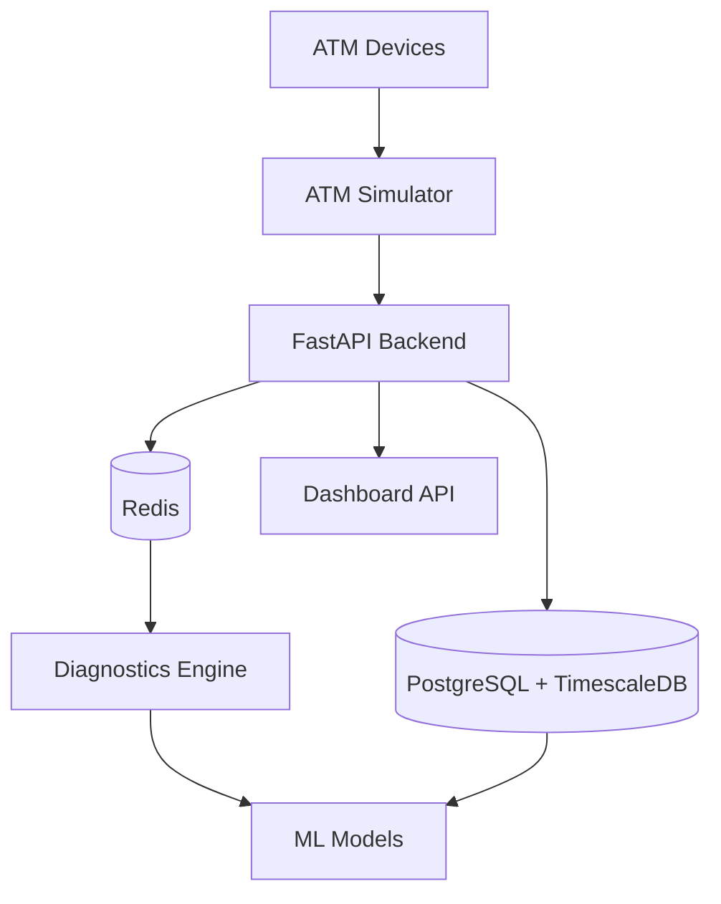

# 🏪 ATM Monitoring System

[](https://www.python.org/downloads/)
[](https://fastapi.tiangolo.com/)
[](https://www.postgresql.org/)
[](https://www.timescale.com/)
[](https://redis.io/)
[](https://www.docker.com/)

**Complete ATM Monitoring, Real-time Analytics & Predictive Maintenance System**

A comprehensive solution for real-time telemetry collection from 500+ ATMs, dashboard monitoring, anomaly detection, and failure prediction.

## 🎯 Key Features

- 🔄 **Real-time Telemetry Collection**: Data collection from 500+ ATMs per second
- 📊 **Live Dashboard**: REST API-based monitoring interface
- 🤖 **AI-powered Diagnostics**: Machine learning for anomaly detection and failure prediction
- ⚡ **High-performance Time-series DB**: Efficient data storage with TimescaleDB
- 🚨 **Real-time Alerts**: Redis Pub/Sub based event processing
- 🐳 **Complete Docker Environment**: One-click development/production setup

## 🚀 Quick Start

### Prerequisites
- Docker 20.10+
- Docker Compose 2.0+
- Make (optional, for convenience)

### Step 1: Project Setup
```bash
# Clone repository
git clone <repository-url>
cd atm-monitoring-system

# Automated environment setup (recommended)
make setup
```

### Step 2: Environment-specific Launch

#### Development Environment (DB + API only)
```bash
make dev
```

#### Full System (including simulator)
```bash
make full
```

#### Individual Service Launch
```bash
# Core services only
docker-compose up -d postgres redis fastapi_backend

# Add simulator
docker-compose --profile simulator up -d

# Add diagnostics engine
docker-compose --profile diagnostics up -d
```

### Step 3: System Verification

#### API Endpoint Testing
```bash
# Health check
curl http://localhost:8000/health

# Dashboard statistics
curl http://localhost:8000/api/v1/dashboard/stats

# ATM status list
curl http://localhost:8000/api/v1/atms/status
```

#### Web Interfaces
- 📚 **API Documentation**: http://localhost:8000/docs
- 🔍 **Schema Explorer**: http://localhost:8000/redoc
- ❤️ **Health Check**: http://localhost:8000/health

## 📁 Project Structure

```
atm-monitoring-system/
├── 📁 1-fastapi-backend/        # FastAPI Backend Server
│   ├── main.py                  # FastAPI application
│   ├── config.py                # Configuration management
│   ├── database.py              # DB models and connections
│   ├── models.py                # Pydantic schemas
│   ├── Dockerfile              # Backend container
│   └── requirements.txt         # Python dependencies
├── 📁 2-atm-simulator/          # ATM Simulator
│   ├── simulator.py             # Core simulation logic
│   ├── config.py                # Simulator configuration
│   ├── run_simulator.py         # Simulator entry point
│   ├── Dockerfile              # Simulator container
│   └── requirements.txt         # Python dependencies
├── 📁 3-diagnostics/            # Diagnostics & ML Engine
│   ├── diagnostic_engine.py     # Rule-based diagnostics
│   ├── ml_models.py             # Machine learning models
│   ├── run_diagnostics.py       # Diagnostics entry point
│   ├── Dockerfile              # Diagnostics container
│   └── requirements.txt         # Python dependencies
├── 📁 scripts/                  # Database & utility scripts
│   ├── init-timescale.sql       # TimescaleDB initialization
│   └── wait-for-it.sh           # Service dependency waiter
├── 🐳 docker-compose.yml        # Main Docker configuration
├── 🐳 docker-compose.override.yml # Development overrides
├── ⚙️ .env                      # Development environment variables
├── ⚙️ .env.production           # Production environment variables
├── ⚙️ .env.example              # Environment template
├── 📋 Makefile                  # Convenience commands
├── 📄 README.md                 # This file
└── 📄 .gitignore               # Git ignore rules
```

## 🛠️ System Architecture

### Component Overview



### 1. **FastAPI Backend** (Port 8000)
- **Role**: Central API server for telemetry ingestion and dashboard data
- **Features**: 
  - Async telemetry processing
  - Auto-generated API documentation
  - Health monitoring
  - Environment-based configuration

### 2. **ATM Simulator** (Configurable count)
- **Role**: Realistic ATM telemetry data generation
- **Features**:
  - 500+ concurrent ATM simulation
  - Realistic failure patterns
  - Configurable transaction patterns
  - Async batch transmission

### 3. **Diagnostics Engine** 
- **Role**: Rule-based diagnostics + ML-powered predictions
- **Features**:
  - Real-time anomaly detection
  - Failure prediction models
  - Comprehensive reporting
  - Maintenance recommendations

### 4. **Database Layer**
- **PostgreSQL + TimescaleDB**: Optimized time-series storage
- **Redis**: Real-time pub/sub and caching

## 🔧 Configuration Management

### Environment Variables

The system uses environment-based configuration for different deployment scenarios:

#### Development (`.env`)
```bash
ENV=development
DEBUG=true
POSTGRES_PASSWORD=password123
NUM_ATMS=500
SEND_INTERVAL=30
```

#### Production (`.env.production`)
```bash
ENV=production
DEBUG=false
POSTGRES_PASSWORD=secure-production-password
NUM_ATMS=1000
SEND_INTERVAL=15
```

#### Key Configuration Options

| Variable | Description | Default | Production |
|----------|-------------|---------|------------|
| `ENV` | Environment mode | `development` | `production` |
| `DEBUG` | Debug logging | `true` | `false` |
| `NUM_ATMS` | Number of simulated ATMs | `500` | `1000` |
| `SEND_INTERVAL` | Telemetry interval (seconds) | `30` | `15` |
| `POSTGRES_PASSWORD` | Database password | `password123` | *secure-password* |
| `REDIS_PASSWORD` | Redis password | `redis123` | *secure-password* |

## 🐳 Docker Commands Reference

### Quick Commands (via Makefile)

| Command | Description |
|---------|-------------|
| `make setup` | Initial project setup with .env creation |
| `make dev` | Start development environment (DB + API) |
| `make full` | Start full system including simulator |
| `make logs` | View logs from all services |
| `make down` | Stop all services |
| `make clean` | Complete cleanup (removes volumes) |
| `make prod` | Start production environment |
| `make test` | Run API tests |
| `make shell-api` | Shell into FastAPI container |
| `make shell-db` | Shell into PostgreSQL container |

### Direct Docker Commands

```bash
# Start core services
docker-compose up -d postgres redis fastapi_backend

# Start with simulator
docker-compose --profile simulator up -d

# Start with diagnostics
docker-compose --profile diagnostics up -d

# View service status
docker-compose ps

# View logs
docker-compose logs -f [service_name]

# Stop services
docker-compose down

# Complete cleanup
docker-compose down -v
```

## 📊 API Reference

### Core Endpoints

#### Health & Status
```http
GET /health
GET /api/v1/dashboard/stats
GET /api/v1/atms/status
```

#### Telemetry Ingestion
```http
POST /api/v1/telemetry
Content-Type: application/json

{
  "atm_id": "ATM-NYC-001",
  "timestamp": "2025-01-20T10:30:00Z",
  "status": "online",
  "temperature": 22.5,
  "cash_level": 75.0,
  "transactions_count": 45,
  "failed_transactions": 2,
  "cpu_usage": 25.3,
  "memory_usage": 65.2
}
```

#### Response Examples

**Dashboard Stats:**
```json
{
  "total_atms": 500,
  "online_atms": 485,
  "offline_atms": 10,
  "error_atms": 5,
  "total_transactions_today": 12450,
  "avg_cash_level": 68.5,
  "critical_alerts": 3
}
```

**ATM Status:**
```json
[
  {
    "atm_id": "ATM-NYC-001",
    "name": "ATM NYC 001",
    "region": "NYC",
    "status": "online",
    "last_update": "2025-01-20T10:30:00Z",
    "temperature": 22.5,
    "cash_level": 75.0,
    "transactions_today": 45
  }
]
```

## 🔍 Monitoring & Diagnostics

### System Health Monitoring

```bash
# Check overall system health
curl http://localhost:8000/health

# Monitor service logs
make logs

# Check container status
docker-compose ps
```

### Database Monitoring

```bash
# Connect to database
make shell-db

# Check TimescaleDB status
psql -c "SELECT * FROM timescaledb_information.hypertables;"

# View recent telemetry
psql -c "SELECT * FROM atm_telemetry ORDER BY time DESC LIMIT 10;"
```

### Performance Metrics

- **Telemetry Ingestion Rate**: ~500 messages/30 seconds
- **Database Storage**: TimescaleDB with compression
- **API Response Time**: < 100ms for dashboard queries
- **Memory Usage**: ~2GB total for full system

## 🧪 Testing

### Automated Testing
```bash
# Run all tests
make test

# Run specific test categories
docker-compose exec fastapi_backend python -m pytest tests/
```

### Manual Testing
```bash
# Test telemetry ingestion
curl -X POST http://localhost:8000/api/v1/telemetry \
  -H "Content-Type: application/json" \
  -d '{
    "atm_id": "TEST-001",
    "timestamp": "2025-01-20T10:30:00Z",
    "status": "online",
    "temperature": 22.5,
    "cash_level": 75.0,
    "transactions_count": 45,
    "failed_transactions": 0
  }'

# Verify data storage
curl http://localhost:8000/api/v1/dashboard/stats
```

### Load Testing
```bash
# Increase simulator load
NUM_ATMS=1000 SEND_INTERVAL=10 make full
```

## 🌟 Production Deployment

### Pre-deployment Checklist

1. **Security Configuration**
   ```bash
   # Copy and secure production environment
   cp .env.production.example .env.production
   
   # Update with secure passwords
   vim .env.production
   ```

2. **Resource Planning**
   - **CPU**: 4+ cores recommended
   - **Memory**: 8GB+ for 1000 ATMs
   - **Storage**: 100GB+ for time-series data
   - **Network**: Stable internet for ATM connections

3. **Production Deployment**
   ```bash
   # Deploy production environment
   make prod
   
   # Verify deployment
   curl http://your-domain.com/health
   ```

### Production Optimizations

- **Database**: Automated backups and replication
- **Caching**: Redis cluster for high availability  
- **Load Balancing**: Multiple FastAPI instances
- **SSL/TLS**: HTTPS termination at load balancer
- **Monitoring**: Prometheus + Grafana integration

## 🛡️ Security Considerations

### Authentication & Authorization
- **JWT-based authentication** (planned)
- **Role-based access control** (planned)
- **API rate limiting** (configurable)

### Data Security
- **Encrypted passwords** in environment variables
- **Database connection encryption**
- **Redis password protection**
- **Container security** with non-root users

### Network Security
- **Internal Docker network** isolation
- **CORS configuration** for frontend integration
- **Trusted host middleware** in production

## 🤝 Contributing

### Development Setup
```bash
# Clone and setup
git clone <repository-url>
cd atm-monitoring-system
make setup

# Start development environment
make dev

# Make changes and test
make test
```

### Code Style
- **Python**: Follow PEP 8, use Black formatter
- **FastAPI**: Async/await patterns, type hints
- **Docker**: Multi-stage builds, security best practices

### Pull Request Process
1. Fork the repository
2. Create feature branch (`git checkout -b feature/amazing-feature`)
3. Commit changes (`git commit -m 'Add amazing feature'`)
4. Push to branch (`git push origin feature/amazing-feature`)
5. Open Pull Request

## 📋 Troubleshooting

### Common Issues

#### Port Conflicts
```bash
# Check port usage
netstat -tulpn | grep :8000

# Use different port
API_PORT=8001 make dev
```

#### Database Connection Issues
```bash
# Check container status
docker-compose ps

# View database logs
docker-compose logs postgres

# Reset database
make down && make dev
```

#### Memory Issues
```bash
# Reduce ATM count
NUM_ATMS=100 make dev

# Check memory usage
docker stats
```

#### Simulator Not Sending Data
```bash
# Check simulator logs
docker-compose logs atm_simulator

# Verify API connectivity
docker-compose exec atm_simulator curl http://fastapi_backend:8000/health
```

### Performance Tuning

#### Database Optimization
```sql
-- Check query performance
EXPLAIN ANALYZE SELECT * FROM atm_telemetry WHERE time > NOW() - INTERVAL '1 hour';

-- Monitor TimescaleDB compression
SELECT * FROM timescaledb_information.compression_settings;
```

#### API Performance
```bash
# Monitor API response times
curl -w "@curl-format.txt" -o /dev/null -s http://localhost:8000/api/v1/dashboard/stats
```

## 📄 License

This project is licensed under the MIT License - see the [LICENSE](LICENSE) file for details.

## 🙏 Acknowledgments

- **FastAPI** - Modern, fast web framework for building APIs
- **TimescaleDB** - Time-series database built on PostgreSQL
- **Redis** - In-memory data structure store for real-time features
- **Docker** - Containerization platform for consistent deployments

---

## 🎯 Getting Started Now

**Ready to monitor 500+ ATMs?**

```bash
git clone <repository-url>
cd atm-monitoring-system
make setup && make full
```

**🌐 Access Points:**
- Dashboard API: http://localhost:8000/docs
- Health Check: http://localhost:8000/health
- System Stats: http://localhost:8000/api/v1/dashboard/stats

**Need help?** Check the [Troubleshooting](#-troubleshooting) section or open an issue!

---

**⭐ Star this repository if you found it helpful!**